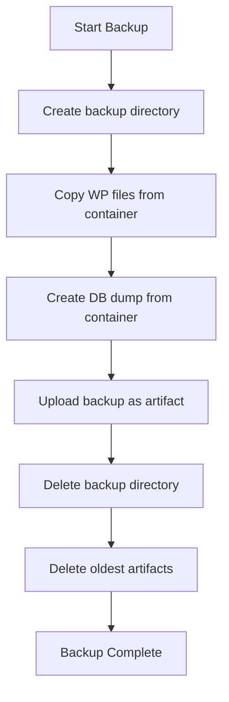
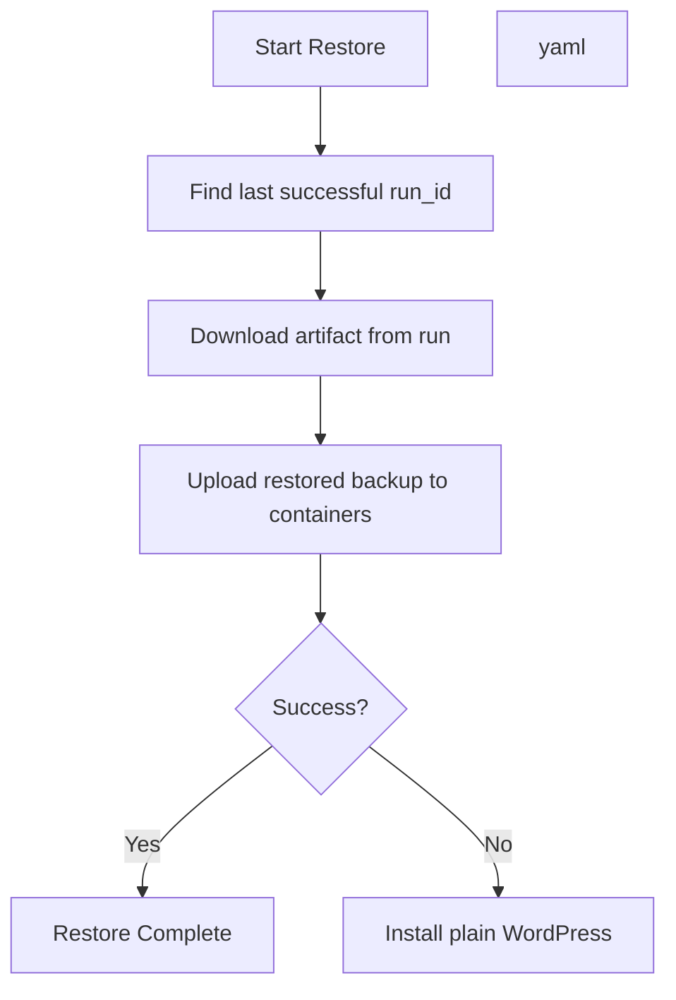

# Save Wordpress state (Back up current Wordress state)
- can be called manually, or automatically when container stops
## Summary
  1. Create directory for backup
  2. Copy WP files from container
  3. Create db dump from container
  1. Upload backup as `artifact`
  2. Delete backup directory
  3. Delete oldest artifacts 

# Restore Wordpress backup workflow
- part of main workflow, restores wordpress from last successfully saved wordpress, can be run manually with specified run_id to restore specific backup  
## Summary
  1. Find last successfull run_id
  2. Download artifact from that run
  3. Upload restored backup to containers
  4. If any pf this steps fails, plain version of WordPress will be installed

